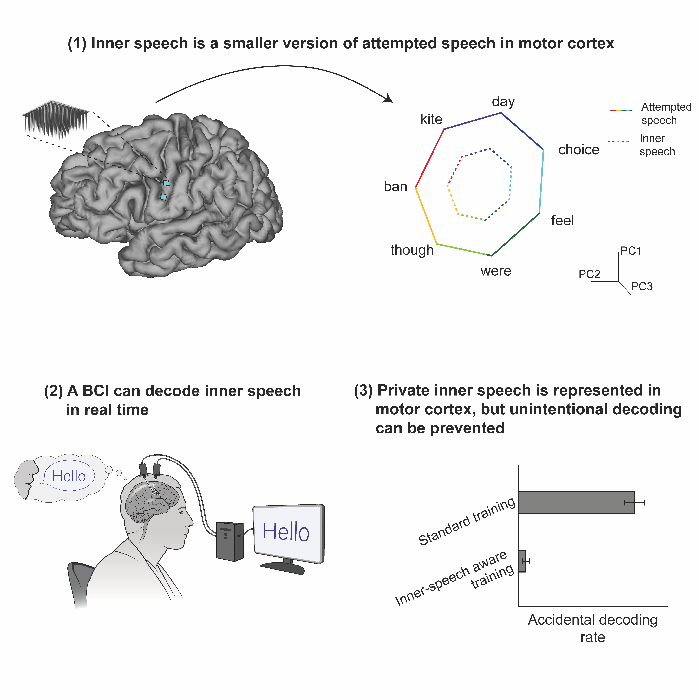

# Inner speech in motor cortex and implications for neuroprostheses

## Overview
This repository is associated with the paper [Kunz, Abramovich Krasa et al. 2025](https://doi.org/10.1016/j.cell.2025.06.015) and [public dataset](https://datadryad.org/dataset/doi:10.5061/dryad.gf1vhhn1j). The code contains relevant analyses to ingest the public data and produce results described in the manuscript.

## Repository structure
| Directory | Description | 
|-----------|-------------|
| `analysis/` | annalysis scripts to generate main text and supplemental figures | 
| `analysis/subfunctions/` | helper functions for data ingesting and anlayses |
| `subpanels/` | images used for subpanels of figures such as task design or analysis description |